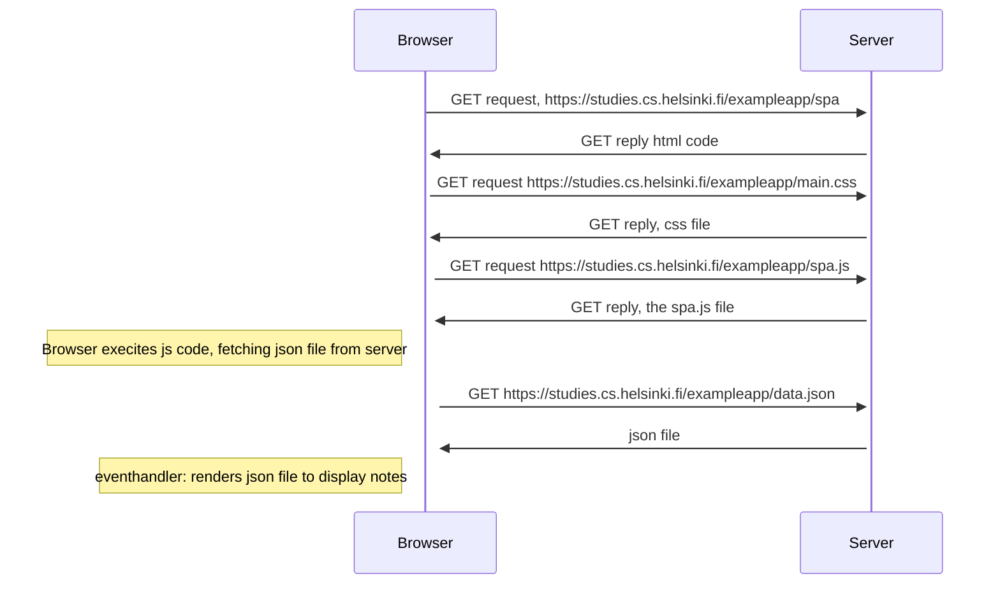

```mermaid
sequenceDiagram
   
    Browser->>+Server: GET request, https://studies.cs.helsinki.fi/exampleapp/spa
    Server->>+Browser: GET reply html code
    Browser->>+Server: GET request https://studies.cs.helsinki.fi/exampleapp/main.css
    Server->>+Browser: GET reply, css file
    Browser->>+Server: GET request https://studies.cs.helsinki.fi/exampleapp/spa.js
    Server->>+Browser: GET reply, the spa.js file
    Note left of Browser: Browser execites js code, fetching json file from server
    Browser->>+Server: GET https://studies.cs.helsinki.fi/exampleapp/data.json
    Server->>+Browser: json file
    Note left of Browser: eventhandler: renders json file to display notes

```
